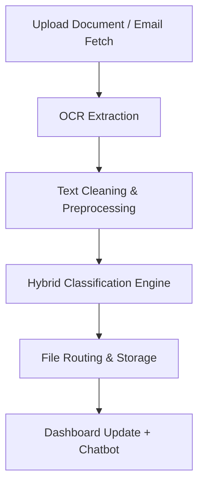

# DocuFlow AI

DocuFlow AI is a full-stack AI-powered system that automates the ingestion, OCR extraction, classification, and routing of documents, with an interactive dashboard for real-time analytics,visualization, and chatbot-based assistance.

---

## Demo Video
🎥 [Watch the demo here](https://your-video-link.com)

---

## Features

-📥 Drag-and-Drop Document Upload (PDF, Images)

-📧 Email Ingestion – Auto-fetch documents from Gmail inbox

-🔍 OCR Processing using Tesseract with image preprocessing for accuracy

-🧠 Hybrid Classification Engine

-Rule-based keyword matching

-ML-based (TF-IDF + Random Forest) classification

-📂 Smart File Routing – Automatically organize into labeled folders

-📊 Real-time Dashboard

-Live classification stats

-Interactive charts (Chart.js)

-Pipeline progress tracking

-🤖 Chatbot Assistant – Query documents and get instant answers

-🔒 User Authentication

-Login & Registration

-Admin-only dashboard access

---

## Tech Stack

| Layer      | Technology                          |
| ---------- | ----------------------------------- |
| Backend    | Flask (Python)                      |
| OCR        | Tesseract                           |
| ML         | scikit-learn, TF-IDF, Random Forest |
| Preprocess | NLTK, regex, OpenCV                 |
| Frontend   | HTML, JS, Bootstrap                 |
| Charts     | Chart.js                            |
| Email      | IMAP, email module                  |
| Database   | SQLite                              |


---

## Architecture Overview


##  How to Run

1️⃣ Clone the Repository

```bash
git clone https://github.com/yourusername/docuflow-ai.git
cd docuflow-ai
```

2️⃣ Create a Virtual Environment

```bash
python -m venv venv
source venv/bin/activate  # On Windows: venv\Scripts\activate
```

3️⃣ Install Dependencies

```bash
pip install -r requirements.txt
```

4️⃣ Configure Environment Variables

Create a .env file:

```ini
FLASK_APP=app.py
FLASK_ENV=development
SECRET_KEY=your_secret_key
EMAIL_USER=your_email@example.com
EMAIL_PASS=your_gmail_app_password
```

5️⃣ Run the Application

```bash
python app.py
```

##  Email Setup

-Enable IMAP access in Gmail settings.

-Generate a Gmail App Password (Account → Security → App Passwords).

-Update credentials in .env file.

-The system auto-checks for new attachments every 15 minutes.

---
##  Dashboard Preview

-📌 Live classification counts

-🥧 Pie chart of document types

-🔄 Pipeline progress (Ingested → Extracted → Classified → Routed)

-💬 Chatbot panel for instant document queries

---

##  Deployment

-  Developed and tested locally using **VS Code**

---

##  Future Enhancements

-LLM-based **Entity Extraction**

-**Cloud Storage Integration** (AWS S3, Google Drive)

-**Multi-language OCR support**

-Enhanced **chatbot with document-specific Q&A**

---

##  Authors

- **Kavya Ramesh**
- **Sruthi S**
- **Karan C J**
- **Rohan S**

---
